<div align="center">


**An independent, power-aware falsification referee for quantitative trading claims.**

_Most edges don't survive. Penrose finds the few that do, and records why the rest didn't._

[](https://github.com/PattersonResearch/Penrose/releases)
[](LICENSE)
[](pyproject.toml)
[](CONTRIBUTING.md)
[](#)

</div>

---

Penrose is a **referee for quantitative research**. It is not a strategy generator and not a
backtester. A backtester measures one strategy's returns and moves on. Penrose asks whether a claim's
evidence can be believed at all, given how it was discovered, and it keeps what it learns. Every
result becomes a durable, reusable **invalidation** that records what was tested, why it did not
survive, and under what conditions. These accumulate into a slowly growing **corpus of
invalidations**, a compounding map of what does not work that no single backtest can build. The rare
claim that survives falsification is flagged for human review; the far more common case of invalidation is kept and investigated for principles (truths or patterns that are valuable despite the broader invalidation). Users can also invoke an experimental synthesis process in which the corpus is mined for connections between principles to form unconfirmed hypotheses to test, a speculative frontier sometimes
referred to as [candidate alpha](#generating-candidate-alpha)<sup>[[8]](#references)[[9]](#references)</sup>.

In use, you give Penrose a claim, whether from a paper, a strategy generator, or yourself. It
reconstructs the claim in a sandbox, tests it under a rigorous robustness stack, **validates its own
detector**, and returns a calibrated [verdict](#verdicts). Penrose finds **no new alpha**, makes no promises to do so; verdicts should not be seen as financial advice or strategy endorsement. Its value is an honest, accumulating account of what does not survive proper testing,
and the discipline to occasionally certify what does.

---

## Features

- **A full falsification stack, not a single statistic.** Each claim runs a gauntlet of independent
  gates: PSR/DSR evidence scoped to the search Penrose has actually seen, three-fold sign stability,
  a regime kill-lens, a bootstrap edge interval, a permutation test, walk-forward consistency, cost
  and capacity modeling, and a single-use locked holdout. A single isolated family run is scored by
  Probabilistic Sharpe plus the robustness stack; DSR deflation strengthens as the family or
  generator ledger accumulates trials. See [docs/GATES.md](docs/GATES.md) for every gate in plain
  language.
- **A power-aware verdict taxonomy.** Every verdict ships a *minimum detectable effect*. A non-result
  on under-powered data is labeled `underpowered`, not `kill`, so a rigorous skeptic is never mistaken
  for a broken always-no machine. "We couldn't resolve it" never becomes "it's dead."
- **A self-calibrated detector.** Before trusting any verdict, Penrose measures its own sensitivity
  and specificity on real data: placebo, injected-edge, native-breadth, dead-state, and
  persistence-matched controls, plus a multi-null battery. See [docs/STRESS_TESTING.md](docs/STRESS_TESTING.md)
  for the runnable stress controls. Almost no system validates its own detector.
- **A discovery/confirmation firewall.** A single-use locked holdout confirms a survivor exactly once
  and then burns, so nothing can be tuned against the confirmation set.
- **A growing corpus of invalidations.** Every verdict becomes a durable, reusable record of what was
  tested and why it failed, a compounding asset no single backtest can build.
- **Referees any source.** Papers, your own theses, code-complete strategies, or machine-generated
  hypotheses, all routed through the same pipeline, with generated candidates charged to the
  multiple-testing denominator.
- **Sandboxed and reproducible.** Untrusted generated code only ever runs inside a Docker sandbox, and
  evaluation paths are deterministic and seeded.
- **Pennie, a corpus-grounded research assistant** that helps you shape a rough idea into a single
  testable hypothesis ([see below](#pennie-your-research-assistant)).

## Why Penrose

Automated quant-research systems now propose, code, and backtest factors with little human input.
They are improving fast, but they select winners by test-set performance over a large search,
with no penalty for the size of that search. Their "winners" are inflated by selection bias, and
selection bias is only one of the ways a backtest lies: low statistical power, look-ahead,
regime-specific luck, ignored costs, and post-publication decay all do the same. A single corrected
statistic does not catch all of them; a referee needs a suite of tools to provide proper verdicts.

Academic record sets the prior: most published anomalies don't survive proper testing
(Hou-Xue-Zhang 2020), they decay after publication (McLean-Pontiff 2016), and the "factor zoo" came
from an enormous undisclosed search (Harvey-Liu-Zhu 2016). So the honest prior on any published or
generated edge is **"probably doesn't survive,"** which is exactly why an *independent, calibrated*
referee has value.

Penrose is that referee. It sits between the **generators** (which don't deflate) and the
**self-audit tools** (which only test your *own* pipeline): it ingests a third party's claim, rebuilds
it, runs it through the full stack (PSR/DSR evidence scaled to the observed search, power accounting,
robustness gates, costs, and a locked holdout), and records a calibrated, power-aware,
provenance-tracked verdict.

## How it works



```
claim -> sandboxed reconstruction -> robustness stack -> power-aware verdict -> corpus
```

For a plain-language tour of every gate in that diagram, with what each one catches and why you
want it, see [docs/GATES.md](docs/GATES.md).

For generated research, a native `penrose dream` source adapter first freezes an immutable candidate
set and preregisters the full generation budget. Eligible hypotheses then enter the same P3-P8
falsification path as extracted paper claims. This makes discarded candidates count toward the
multiple-testing denominator instead of letting the generator report only its favorites.

The robustness stack: PSR/DSR scoped to the observed search, a single-use locked holdout,
walk-forward, a regime kill-lens (it catches edges concentrated in one calendar/vol/trend regime),
bootstrap edge CI, a permutation test, capacity/impact, a fee curve, and a fidelity check that the
code faithfully tests the claim. Untrusted auto-generated code **only ever runs inside a Docker
sandbox,** never in Penrose's own process.

The **brain** accumulates verdicts and finds structure across them (shared failure modes,
cross-domain links, principles). Hard rule: these connections **inform, they never gate.** The
corpus contextualizes a result for a human; it never auto-rejects a new idea. Every new claim is
tested independently on its own data.

### Generating candidate alpha

Penrose can also produce its own **candidate alpha** from the user's corpus of past results, not only
referee external ones (the `dream` and synthesize paths). These candidates are fundamentally **untested hypotheses**, never
predictions of profit: each one re-enters the same falsification path above, is capped at `watch`
until independently confirmed, and the quality of corpus-generated candidates is an open research
question rather than a promised standard.

## Verdicts

Every claim resolves to one of four verdicts. The point of the taxonomy is to separate *tested and
rejected* from *could not be resolved*, which most backtesters conflate.

| Verdict | What it means |
|---|---|
| `research-supported` | Cleared the full stack: PSR/DSR evidence above threshold for the observed search, three-fold sign-stable, regime-robust, bootstrap CI excludes zero, permutation-clean, walk-forward-consistent, and confirmed on a single-use locked holdout. It means "survived falsification," not "will be profitable," and still requires human review. |
| `watch` | Survived the kill gates but not certified: either it sits in the borderline band, or it is capped (for example, costs are modeled rather than measured, or it is a generated hypothesis not yet independently confirmed). A provisional survivor worth tracking. |
| `underpowered` | The data was too thin to resolve an effect of the claimed size. Not a rejection, an inconclusive. Every verdict ships a minimum detectable effect; when the claimed edge is below it, the result is `underpowered` rather than a false `kill`. It also ships a *resolution estimate*: roughly how many more out-of-sample trades, or how much cross-sectional breadth, would settle it. |
| `kill` | Tested with adequate power and rejected. The sample could resolve an effect of the claimed size, and the claim does not survive deflation and the robustness stack. |

Claims that cannot be evaluated yet receive a routing state instead (`needs_data`, `pending_module`,
`cannot_replicate`, `insufficient_data`, `off_domain`), which is distinct from a verdict on the evidence.

New to this? [docs/GATES.md](docs/GATES.md) explains every test behind these verdicts in plain
language, written for a motivated aspiring quant rather than only for a seasoned academic.

## Where Penrose fits

Penrose is not a backtester and not an alpha generator, and it does not compete with either. It is
the layer they leave out.

- **Backtesting frameworks** ([zipline](https://github.com/quantopian/zipline),
  [backtrader](https://github.com/mementum/backtrader),
  [vectorbt](https://github.com/polakowo/vectorbt),
  [nautilus_trader](https://github.com/nautechsystems/nautilus_trader)) simulate a strategy's
  returns. They measure faithfully, but they do not account for how many strategies you tried before
  keeping the one you report.
- **ML-for-finance platforms** ([Qlib](https://github.com/microsoft/qlib),
  [RD-Agent](https://github.com/microsoft/RD-Agent)) generate and rank factors and models. They are
  strong at discovery, and Penrose treats them as exactly that: generators whose search size has to be
  paid for. Neither deflates a candidate by the size of the search that produced it, holds a single-use
  confirmation set, or validates its own detector.
- **The methodology is established and cited, not invented here:** the Deflated Sharpe Ratio (Bailey
  and Lopez de Prado), the factor-zoo and multiple-testing critique (Harvey, Liu, and Zhu), and the
  replication record (Hou-Xue-Zhang, McLean-Pontiff).

Penrose is the inference-governance layer on top of that stack. The contribution is **integration and
self-calibration**, not a "first" or a discovery of alpha: it takes a claim or a generated candidate,
deflates by the real search size, holds a single-use confirmation set, validates its own detector, and
returns a calibrated verdict. Use it *alongside* those tools, not instead of them.

## Quickstart

```bash
git clone <repo> && cd Penrose
pip install -e .             # editable: Penrose runs the scripts that ship in the clone

# the guided demo runs the clean-room path (no key, no external data for the core):
jupyter notebook notebooks/penrose_demo.ipynb

# or from the command line (no key needed):
penrose eval                 # ground-truth: planted strategies with known verdicts
make calib-nulls            # the 5-null specificity battery (0/300)
make calib-sensitivity      # the detection-threshold sweep
make connections            # the brain's advisory connection-discovery

# these need the CZ data download and/or a model key (see the notebook):
make cz-referee             # referee the published factor literature (needs the CZ data)
penrose dream -n 10 --generate-only  # preregister a generated search (needs a model key)
penrose dream -n 10          # generate candidates and send eligible ones through the referee (needs a key)
make dash                   # the researcher dashboard (localhost)
```

The core (`eval`, `calib-*`, `connections`) runs on `pip install -e .` alone, with no API key and no
external data. The full pipeline (ingesting a paper) and the literature/generator experiments need a
model key and/or a data download; the notebook walks through both. Commands that need a key fail with a
clear message, never a crash, if one is not set.

## MCP server (optional)

An agent can query Penrose over the [Model Context Protocol](https://modelcontextprotocol.io):

```
pip install -e ".[mcp]"
penrose-mcp                 # runs the read-only MCP server
```

It exposes five **read-only** tools: `penrose_verdicts`, `penrose_proposals`,
`penrose_principles` (distilled cross-run proposals), `penrose_data_requests`, and `penrose_status`.

By design it **exposes operations, not escape hatches**: every tool only reads results Penrose already
produced. Nothing over MCP can approve or promote a verdict (the P9 sign-off stays human), write the
approved corpus, run a paper, or run a module — so an agent can pull what Penrose found without being
able to make Penrose fool itself. `mcp` is an optional extra; the core install never requires it.

## Results

- **Referee a generator.** Of 16 factors a generative system ([Microsoft RD-Agent](https://github.com/microsoft/RD-Agent)) produced on real
  data: **14/16 killed per-factor, 0/16 survive deflation across the full search,** including
  positive-Sharpe factors a naive backtester certifies, which Penrose kills as regime-fragile.
- **Referee the published literature.** Across all 212 Chen-Zimmermann anomalies, survival is a
  *range*: **~48% per-anomaly down to ~3%** when deflated by the whole 212-anomaly search. The
  dependence of "survival" on deflation scope is itself a finding.
- **Post-publication decay.** Decay is universal (**~52%**, reproducing McLean-Pontiff). Penrose does
  *not* beat it, but its survivors retain ~**4x the post-publication return** of its kills, so the
  verdict sorts anomalies by post-decay value.
- **Calibration.** Placebo: 0/100 noise signals certified. 5-null battery: 0/300. The detection
  floor is a sample-power artifact (it falls with more history and breadth toward the realistic
  0.02 to 0.05 IC range), not a fixed limit.

See [`docs/PENROSE_SYSTEMS_PAPER.md`](docs/PENROSE_SYSTEMS_PAPER.md) for the full system write-up, and
[`docs/FPES_STANDARD_PAPER.md`](docs/FPES_STANDARD_PAPER.md) for the underlying evidence standard. All points listed here are reproducible with the information found in this repository.

## Pennie, your research assistant

Pennie is the chat assistant built into the Penrose dashboard. She is a skeptical research
collaborator, not an oracle and not a trader. Her one job is to help you turn a rough idea into a
single hypothesis Penrose can actually test, then hand it to the pipeline. She is the chat box in the
diagram above, the one reading from the corpus of invalidations.

**How she works.** Pennie is a chat loop with two things wired in. First, a deliberately skeptical
role that steers every conversation toward a testable claim: she pushes you to pin down the five things
Penrose needs, which are a single falsifiable directional claim, a signal-to-forward-return mechanism
with no look-ahead, data that plausibly exists, a measurable horizon with non-overlapping trades, and an
explicit falsifier. Second, **corpus grounding**: before each reply she runs a read-only,
discovery-safe retrieval over the corpus of invalidations and prior findings, and uses what surfaces to
ground the conversation (for example, "Penrose already killed a similar funding-carry claim as
regime-fragile"). When the idea is testable you click **Prepare Hypothesis**, and Pennie rewrites the
whole conversation into one clean labeled thesis (Claim, Mechanism, Scope, Horizon, Data, Falsifier).
You review it, and only if you confirm does it enter the inbox for the next run. Nothing is submitted
behind your back.

**What Pennie can do**

- Discuss signals, mechanisms, data sources, costs, and regimes, and sharpen a vague idea into a single
  falsifiable hypothesis.
- Ground answers in Penrose's own prior findings, the corpus of invalidations, discovery-safe.
- Read an attached paper's text in-conversation for discussion (it is not auto-queued for testing).
- Draft a clean, ingestable thesis and, on your confirmation, queue it for the falsification pipeline.

**What Pennie cannot (and will not) do**

- She never says an idea "works," "is profitable," or "makes money." She cannot know that; only the
  backtest decides. She will instead surface look-ahead, overlapping-window inflation, missing data, and
  cost problems.
- She does not run the backtest or assign a verdict. Pennie shapes the *input*; the falsification
  pipeline and its gates do the judging.
- She never sees or touches the locked holdout. Her corpus access is discovery-safe by construction, so
  talking to Pennie cannot contaminate a future confirmation.
- She does not auto-submit. A human confirms before any thesis enters the inbox.
- She is an optional, local, model-backed convenience. The core test suite, calibration, and worked
  example need no API key; Pennie does, because she is a generation path.

### Retrieval

Pennie's chat path grounds replies in prior corpus findings for context only, never as proof. The
corpus (`dashboard/corpus.json`) is built up as you run the pipeline, so on a fresh clone it is empty
and retrieval simply returns nothing until you have accumulated results. Retrieval runs entirely in
this repo: `pip install -e ".[embed]"` enables in-process FastEmbed vector search with
`BAAI/bge-small-en-v1.5`; without that optional extra, retrieval falls back to deterministic lexical
scoring. No external embedding service is required.

## Limitations

- **Reconstruction fidelity** is the central risk for prose inputs ("you tested a broken approximation
  of my strategy"), and a depreciating moat as foundation models improve. The strongest use is
  refereeing *code-complete* candidates, where this risk disappears.
- **Claim-type routing is English keyword-based.** Claims are routed (descriptive-statistical vs
  trading-strategy vs structural) by English-text cues; non-English or unusually phrased claims fall
  through to the `trading_strategy` default. That fail-open is conservative (tested as a strategy, not
  mis-specialized), never a crash.
- **Deflation is not magic on the first look.** On the first single-claim run in a family, DSR is
  effectively PSR; deflation engages as Penrose sees multiple trials, registered generator
  candidates, or populated partitions in the same search family.
- **Low-breadth detection floor:** marginal single-asset edges are genuinely unresolvable on short
  samples, hence the `underpowered` label rather than a false kill.
- **Look-ahead defense is layered.** Generated modules run in Docker and are checked for static leak
  idioms; the dynamic truncated-bundle check is strongest when it runs on the same execution path.
- **Fidelity verification can use an independent verifier, but defaults to the same provider.**
  Set `PENROSE_LLM_VERIFIER_MODEL` (and, for a genuinely independent endpoint,
  `PENROSE_LLM_VERIFIER_BASE_URL` / `PENROSE_LLM_VERIFIER_API_KEY`) to route the fidelity check to a
  different model/provider and reduce correlated implementation-and-judging errors; unset, it falls
  back to the same provider, and each result records whether the check was independent.
- **Holdout confirmation is gated and scarce.** It is single-use per claim, must pass the configured
  holdout evidence threshold, and production runs with modeled costs are capped at `watch` even when
  the statistical path is strong.
- **Generated hypotheses have no external evidentiary anchor.** Dream results are labeled
  `generated_hypothesis`, their fidelity is only LLM self-consistency, they never inspect the locked
  holdout during triage, and they are capped at `watch` until independently confirmed.
- This is a **research prototype.** The contribution is methodology and measurement, not a product,
  and not a source of trading advice.

See [ROADMAP.md](ROADMAP.md) for where this is going, and [AGENTS.md](AGENTS.md) if you are pointing a
coding agent at the repo.


## Why is it called Penrose?

Penrose is named for the [Penrose process](https://en.wikipedia.org/wiki/Penrose_process), Roger
Penrose's mechanism for extracting energy from a rotating black hole. Almost everything that enters a black hole is
swallowed, but a rare fraction escapes the ergosphere carrying away *more* energy than it arrived with. The gauntlet of real conditions, deflation, costs, regimes, and a single-use locked holdout, is the black hole, and nearly every edge that enters is destroyed. What falls in is not wasted: it becomes the corpus of invalidations that Penrose mines for new candidates. The rare
claim that escapes falsification is the fraction that gets out enriched, the small part that survived the thing that kills almost everything. It is never guaranteed profit, only the candidate worth confirming.

## References

1. Bailey, D. H., and López de Prado, M. (2014). The Deflated Sharpe Ratio: Correcting for Selection Bias, Backtest Overfitting and Non-Normality. *Journal of Portfolio Management*, 40(5), 94-107. <https://ssrn.com/abstract=2460551>
2. Harvey, C. R., Liu, Y., and Zhu, H. (2016). ...and the Cross-Section of Expected Returns. *Review of Financial Studies*, 29(1), 5-68. <https://doi.org/10.1093/rfs/hhv059>
3. Hou, K., Xue, C., and Zhang, L. (2020). Replicating Anomalies. *Review of Financial Studies*, 33(5), 2019-2133. <https://doi.org/10.1093/rfs/hhy131>
4. Chen, A. Y., and Zimmermann, T. (2022). Open Source Cross-Sectional Asset Pricing. *Critical Finance Review*, 11(2), 207-264. <https://doi.org/10.1561/104.00000112> Code/data: <https://github.com/OpenSourceAP/CrossSection>
5. McLean, R. D., and Pontiff, J. (2016). Does Academic Research Destroy Stock Return Predictability? *Journal of Finance*, 71(1), 5-32. <https://doi.org/10.1111/jofi.12365>
6. Politis, D. N., and Romano, J. P. (1994). The Stationary Bootstrap. *Journal of the American Statistical Association*, 89(428), 1303-1313. <https://doi.org/10.1080/01621459.1994.10476870>
7. Li, Y., Yang, X., Yang, X., Xu, M., Wang, X., Liu, W., and Bian, J. (2025). R&D-Agent-Quant: A Multi-Agent Framework for Data-Centric Factors and Model Joint Optimization. <https://arxiv.org/abs/2505.15155> Code: <https://github.com/microsoft/RD-Agent>
8. Planton, J. (2026). AlphaSeeker: A Framework for Systematic Alpha-Seed Discovery from Tick Data. TFM Quantitative Trading Ltd, working paper. SSRN. <https://papers.ssrn.com/sol3/papers.cfm?abstract_id=6823559>
9. Stephan, R. (2026). Sequential Tradeability Testing for Alpha Signals. SSRN working paper. <https://papers.ssrn.com/sol3/papers.cfm?abstract_id=6922558> Replication: <https://github.com/ranystephan/sequential_tradeability>

## License

Apache-2.0 (see `LICENSE`). The framework is open; if you build on it, a citation to the paper is
appreciated.

## Contact

Bugs, questions, and ideas: please use **GitHub Issues / Discussions**, the primary channel.

To follow the project, **Star/Watch** the repository. For anything else, including interest in a hosted
referee or a team deployment down the line, email **hello@penrose.systems**. No product is for sale
today; this is a research release.

## A note from the author

Thank you for taking the time to look at Penrose. I built it because I wanted an honest, shared
reference for the quant community, a place where a claim has to survive real scrutiny before anyone
believes it, and where what fails is kept and learned from instead of quietly discarded. It is a
research prototype, not a finished product, and I would genuinely rather you try to break it than take
it on faith. If it helps you, or if you find where it is wrong, I would love to hear from you.

Charles Patterson
